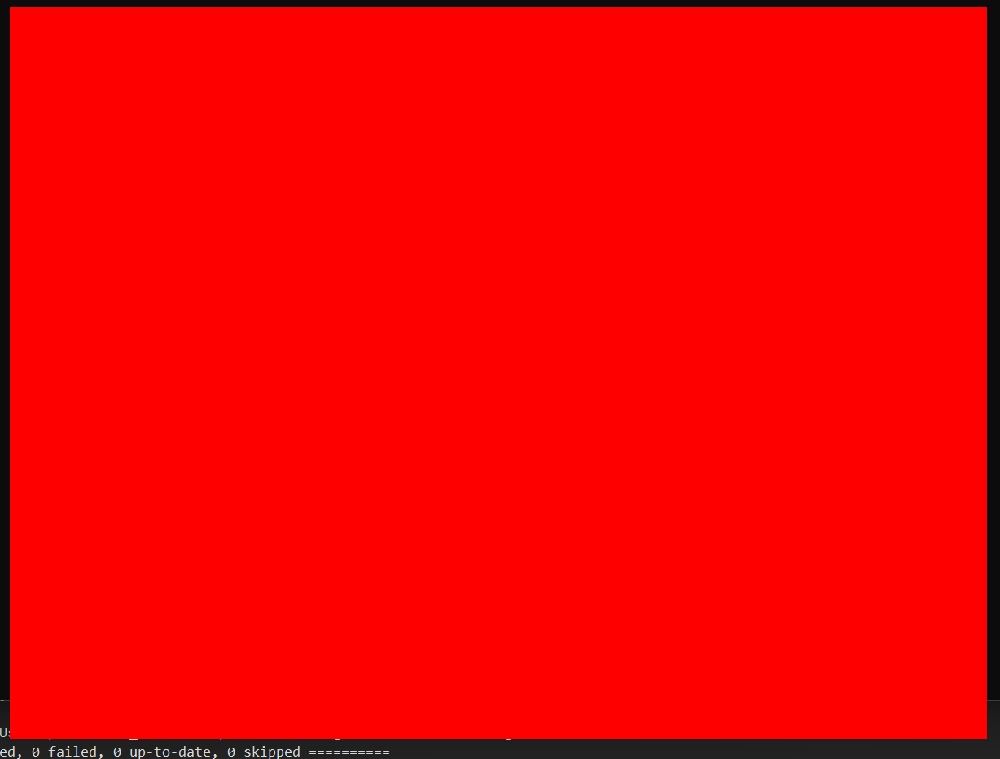
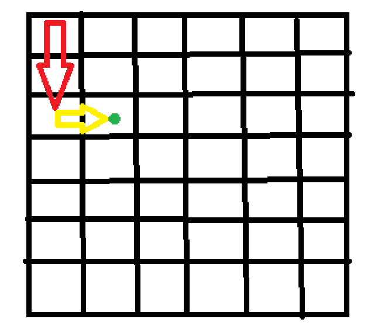
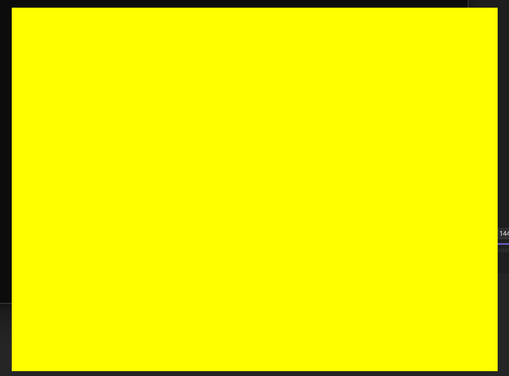

# Introduction

## Software Rendering
 - CPU based processing - software based rendering
 - GPU based processing - hardware based rendering
## Overview
- Pure C and SDL - why? for code to be portable. it is easy to go from C  to C++ or any other language or even OS.
- Foundation of 3D graphics - rasterize a line, drawing a pixel, mapping a triangle etc.
- Setup an environment
- Trigonometry and Lin Algebra
- Vertices and Meshes
- Displaying Pixels and Color Buffer
- 3D projection and perspective
- Rasterizing lines and triangles
- Handling textures and texture mapping
- Camera and view transformation
- Display 3D Models - lighting and reading data from files

# Compiling
Why C - pretty simple, fast, memory management, portable. SDL, the library we will use new, to have the correct permission to manipulate pixels, cuz every OS has its own functions do the sane things. SO SDL solves this problem and have a single code to accomplish the same thing in different OS.

## Setup for windows
 - We are tied with what windows wants us to use, so we need to use visual studio
 - Flow Compiling - we write our C code in the main.c file and then we need to translate that code into machine code using the gcc compiler which can be done using the command ```gcc file.c -o outputFile``` and that we can execute to run our code.
 - Some Compiler Flags
	 - ```-Wall``` - Show all warnings
	 - `-std=c99` - Standard for code, c99 is the standard we are using
 - It can get painful if we have to write the command to compile every time, this is why we have a makefile to list all the rules for building
 - Makefiles - make file take certain rules, `Build` the command to build the project, `run` to run the build and `clean` to remove the build
 - VS + SDL - 
	 - Make sure to have the C++ development in VS
	 - Make your new solution
	 - Download SDL2 from their website extract it and put it inside the C folder
	 - Now we can setup the VS to recognize SDL2 cause right now `#include<SDL.h>` give an error, cause the compiler doesn't know where the header file is
	 - Go to the properties of the solution, and add the lib and include folders to the Library Directories and Include Directories in the VC Directories.
	 - Also need to include these to the linker so we can build the project properly with files we need to include. The new dependencies are `SDL2.lib` and `SDL2main.lib`
	 - For SDL to work the main function should look like this with the args - `int main(int argc, char* args[]()` 
	 - After all this our code builds properly but we still need to include the `.dll` file. This file can be found in the lib folder, and then we can add it to folder for the project.

# SDL Setup and Color Buffer
Lets try and set the color of a single pixel
## Creating an SDL Window
To see our pixels and 3D objects, we need a window and renderer added to that window. To do this we need to initialize both. SDL has functions to create both for us, both functions take params that can help modify the window. `SDL_CreateWindow()` and `SDL_CreateRenderer()`

## Rendering an SDL Window
Same idea as the game loop where we setup first, then enter a loop where we get the users input, then update the frame and the render the new the frame, which is the skeleton of a game.

For our process input we can add and event to check for user events. The only events we can check for now our if the user clicks the x button. To do this SDL has `SDL_QUIT` which is an event that get called when the x button is pressed and we need to stop the renderer too. Other is for pressing escape, so when the event is a key down and the key symbol is escape we need to exit out of the loop. 

Then we can draw a color to the rendering by using `SDL_SetRendererDrawColor()` and passing the renderer and color. And then we need to clear the renderer and present the view. We need to clear the renderer before because we are drawing over the entire screen. And there are other thing that change the renderer and also another reason would be since the draw color is another API call.

After running the code the renderer should look like this.



**Note - for linker error we could pass the lib dependencies as a flag.**

## Declaring a Color Buffer
Now we have been able to display and render a window, simple. Next, we want to control each pixel, which brings us to the color buffer / pixel buffer. Basic idea is we can assign a color to each pixel by adjusting numbers. Now the idea is that in memory we have an array with numbers (hexadecimal) which represents our color buffer, which we give to SDL to render as a 'texture'. The size of the array depends on the size of the window.

Now each number is a hexadecimal with 8 digits, where every 2 digits are used to represent Alpha, Red, Green and Blue. Which makes sense as we know that for each value in RGBA is form 0 - 255 aka 256 options. And 2 hexadecimal digits represent `16 * 16 = 256` values which makes it possible to represent every possible color.

$$
0xFFFF0000
$$

This represents the color red as alpha which is the transparency that is 255, meaning fully opaque and red is also max while green and blue are zeros.  

Now we need a data structure to store all these numbers, which means we need 32 bits to store each value. Well, isn't that just an int? (int = 4bytes = 32bits), but the problem comes with C, that on different machines the bits required to store ints is different. On a 16-bit machine an int takes 2bytes to store so we wont have enough bits to represent all the RGBA values. So we need to guarantee that we have a fixed-size type. 

The new C standard comes with type of fixed-size type, example `uint8_t` which has a unsigned int of 8 bits. `_t` doesn't really have a special meaning, but it just denotes a type name that are used my that standard of C. So for our case `uint32_t` aka an unsigned int of 32 bits should do the job.

To represent our color buffer we can just create a pointer to an `uint32_t` so it would look something like this - `uint32_t* color_buffer` . Now why a pointer and not an array notation? well the pointer we are using is pointing in memory to the first pixel in the window. And then we need to define how big is the buffer? which is as big as the number of pixels in the window aka the height and width of window. 

We still need to tell the compiler to allocate this memory to store our color buffer with all our encoded color values. We can just use `malloc` to do this to allocate a buffer of size `sizeof(uint32_t) * window_width * window_height` which is just the total bytes needed to represent all the pixels. And now with `[]` we can access each pixel, but keep in mind its not a table but a linear list.  So to access the pixel at row 3 and column 2 you would do it like this, `color_buffer[(window_width)*3 + 2]` because to move down the table you need to traverse down the you need to traverse the whole width of the table and the offset it by the column you want. 



## SDL Texture
In our renderer we first need to clear our color buffer.  We should be also able to clear the buffer with a color too. This we can just loop our color buffer and manually set the color for every item in the buffer. Now even after we set the buffer it doesn't actually set the buffer color on the renderer.

We need to copy everything in our color buffer to a SDL texture and then we can just render this texture. The SDL texture need to know the renderer, the pixel format which is basically how we are encoding our color for us it would be `SDL_PIXELFORMAT_ARGB8888` , which tell you the order and bits for the values. Other flag we pass is `SDL_TEXTUREACCESS_STEAMING` which basically tell the renderer that this texture will update frequently and is lockable other options are [here](https://wiki.libsdl.org/SDL2/SDL_TextureAccess) . Other than this we give the width and height of the texture.

Other than this we need a function to update the texture every "frame". SDL has a function to update a texture which we can send our puffer to with the texture pitch which it just the width of the texture, this would be in bytes. Next we need to tell SDL to update the renderer by calling the `SDL_RenderCopy` 

Now with all this in we have a simple 2D raster in place and we have full control of our color buffer, with this we can change even a subsection of the window.



## Fullscreen Window
Now something we really want is to set the display to Fullscreen, why not? So for the full screen all we need to do is change the window width and height. We can use `SDL_DisplayMode` to get the current monitors window width and height which we can assign to our SDL window.

But this is not real full screen but just a borderless window being stretched to cover the screen. We can fix this by using `SDL_SetWindowFullscreen` which changes the window to real full screen with video mode.